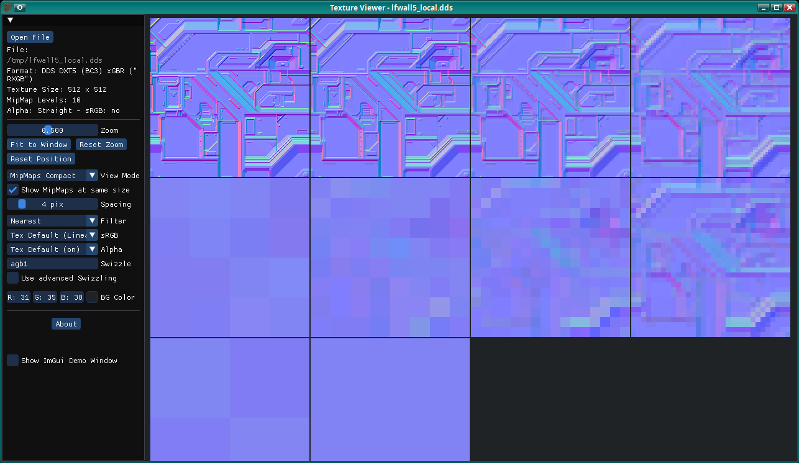

# A Texture Viewer



Still very much work in progress, but at already feels like an image/texture viewer.

You can drag the texture around the window (with left mouse button), zoom with the mousewheel
and you can press your `R` key to reset the view.

Contributions are welcome, but maybe ping me first so we don't accidentally implement the same thing twice :)

**Goals:**

- [x] Support at least Windows and Linux (and probably similar Unix-likes)
    - [ ] maybe Mac if someone with a Mac takes care of that.
- [x] Self-contained executable using OpenGL, [Dear ImGui](https://github.com/ocornut/imgui),
      [GLFW3](https://www.glfw.org/), [Native File Dialog Extended](https://github.com/btzy/nativefiledialog-extended/),
      [libktx](https://github.com/KhronosGroup/KTX-Software/) and [stb_image.h](https://github.com/nothings/stb/blob/master/stb_image.h).  
      All statically linked (except for OpenGL, of course) and contained in this repo.
- [x] Load some common image file formats (whatever stb_image.h supports :-p) and DDS textures
      containing BC1-7 or ASTC data
    - [x] Support more (esp. uncompressed) formats in DDS textures
    - [x] Maybe also KTX and KTX2
    - [ ] maybe obscure formats from games like Quake2
- [x] Show some basic info (format, encoding, size, ...)
- [ ] Implement filters for filepicker so it only shows supported formats
- [x] Support selecting mipmap level for display
- [ ] Show errors/warnings with ImGui instead of only printing to stderr
- [x] Zooming in/out, dragging the texture around the window
- [x] Support selecting linear and nearest filtering
- [x] Support showing all mipmap levels at once
    - [x] in a spiral-ish compact form, in a column, in a row
    - [x] at their relative sizes OR all in the same size (there the spiral probably should be a grid)
- [x] Support tiled view
    - [ ] including with different mipmap levels next to each other to see how the transitions line up
    - [ ] ideally also a perspective view with a big plane going towards infinity to see the texture's
          mipmapping (with different anisotropic filtering levels) in action
- [ ] Let user set swizzling of color channels (and maybe swizzle automatically for known swizzled formats like "RXGB" DXT5)
    - will have to start using shaders for this.. I hope I can still continue using legacy GL then :-p
- [ ] Maybe different texture files next to each other (for example to compare quality of encoders)
- [ ] List of textures in current directory to easily select another one
    - [ ] If one can also navigate to `..` and subdirectories here, it could even be a full alternative to the filepicker
    - [ ] ... and it could be used to navigate archives like ZIP (that are currently not supported at all).  
          But that's more in the "maybe at some point" category
- [ ] Support more than just 2D textures
    - [x] cubemaps
    - [ ] texture arrays
    - [ ] 1D textures
    - [ ] 3D textures?

**Maybe at some point:**

* Support rendering texture on a 3D object (cube, sphere, ...) with additional textures (normalmap, ...)
  and moveable light and camera
    - Allow customizing shader code for that (feasible with OpenGL as it takes GLSL directly)
* Diffing images (e.g. to show differences between source image and compressed texture)
* Support decoding compressed formats in software so such textures can be displayed even if the GPU/driver
  doesn't support them (e.g. ASTC currently isn't shown on NVIDIA GPUs because they only support it
  for OpenGL ES but this tool uses Desktop OpenGL)

## Building:

```
mkdir build
cd build
cmake ../src
make -j8
```

or generate a VS solution and build that, or use ninja, or whatever.

**Dependencies on Linux** (apart from a C++14 compiler, CMake and make or ninja):
* For the integrated GLFW:
    - libwayland-dev libxkbcommon-dev xorg-dev (or your distro's equivalents)
    - see also https://www.glfw.org/docs/latest/compile.html
* For the integrated "Native File Dialog Extended" library:  
  Either `libgtk-3-dev` or (when passing `-DNFD_PORTAL=ON` to cmake) `libdbus-1-dev`
    - the latter uses the `xdg-desktop-portal` protocol for the filepicker, giving you a native
      filepicker even when using KDE (instead of always using the Gtk3 one).  
      Needs `org.freedesktop.portal.FileChooser` interface version >= 3, which corresponds to
      `xdg-desktop-portal` version >= 1.7.1, **at runtime**.  
      See also https://github.com/btzy/nativefiledialog-extended/#using-xdg-desktop-portal-on-linux

On **Windows** it just needs a recent Visual Studio version (I tested VS2022, but probably >= VS2015 works).
